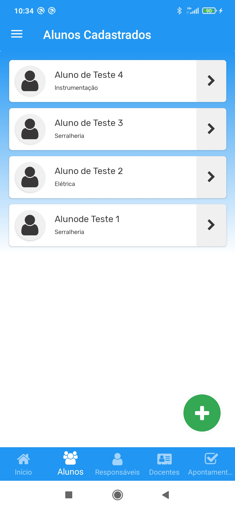
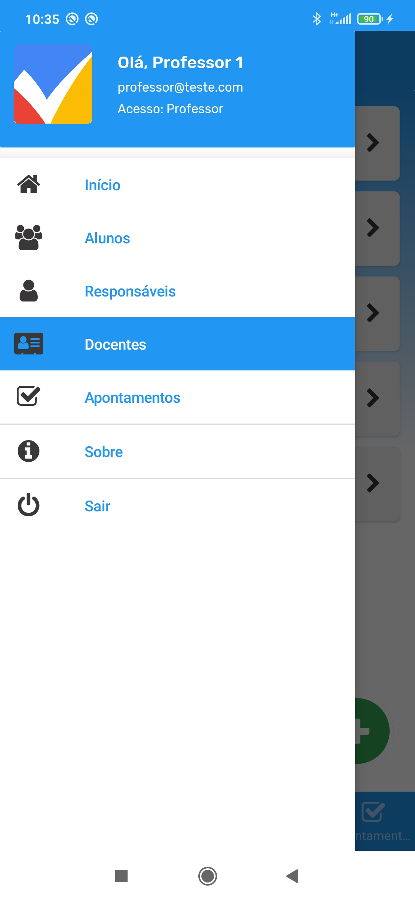
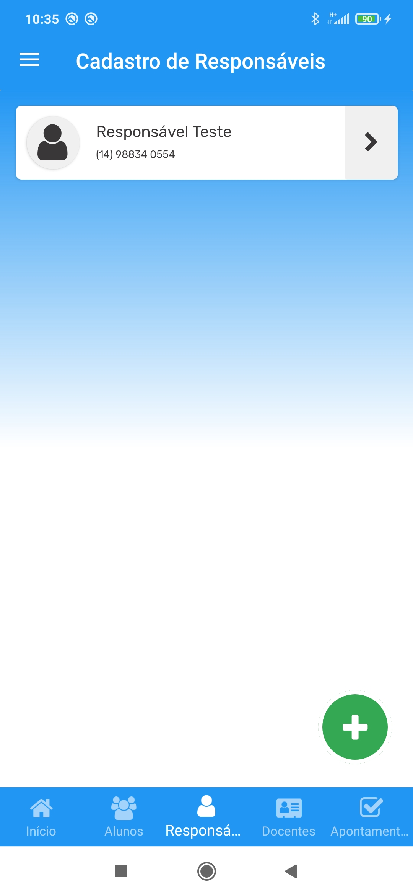
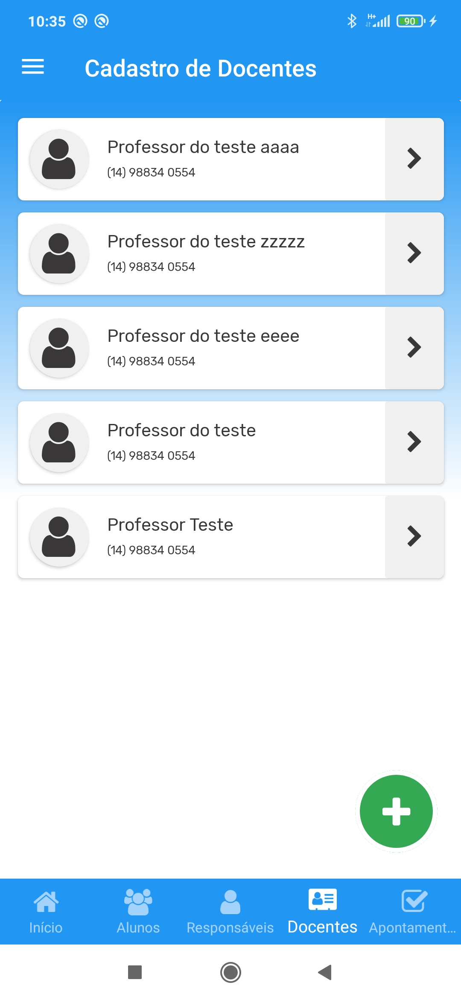

## DESCRIÇÃO DO PROJETO
Aplicação web que permite um controle de frequência, conteúdo de aulas, lançamento de notas, cadastro de turmas, cadastro de acessos, e relatórios;

## TECNLOGIAS
- C# .NET (MVC)
- Xamarin Forms
- MySQL

## FUNÇÕES DA APLICAÇÃO WEB SERVICE
- [x] GET/POST de Acesso;
- [x] GET/POST de Alunos;
- [x] GET/POST de Docentes;
- [x] GET/POST de Responsáveis;
- [x] GET/POST de Apontamentos;

## FUNÇÕES DA APLICAÇÃO MOBILE
- [x] Cadastro de Acesso;
- [x] Cadastro de Alunos;
- [x] Cadastro de Docentes;
- [x] Cadastro de Responsáveis;
- [ ] Perfil de Acesso;
- [ ] Lançamento de Apontamentos;

## TELAS DA APLICAÇÃO

## DESENVOLVEDOR

- Carlos Alexandre Cavalheiro
